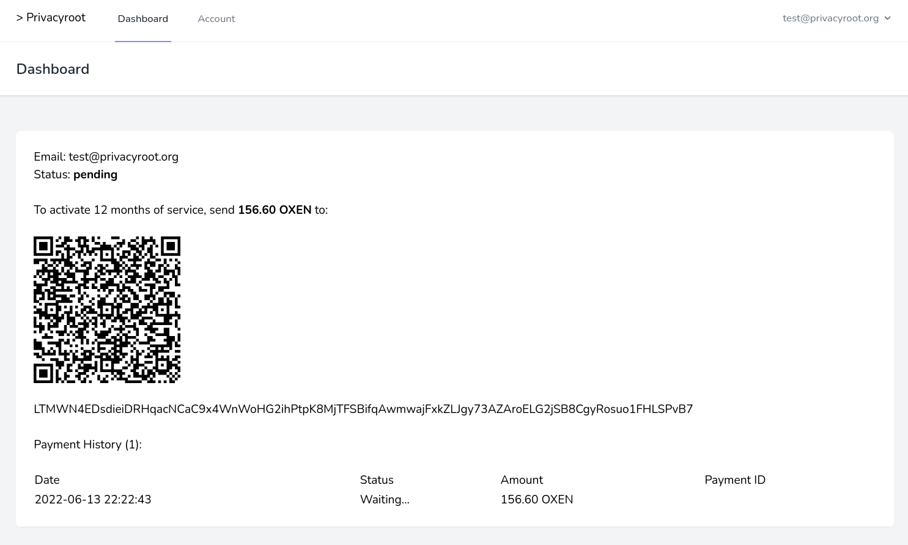

## About Privacyroot

[Privacyroot](https://privacyroot.org) aims to foster decentralization, digital privacy, data ownership and digital sovereignty by providing anonymous access to privacy-respecting core services; starting with email.

## Portal

The Privacyroot Portal is open source - developed with Laravel, Livewire and Tailwind. It will allow users to:

- Register, administer and delete account
- Make payments and delete payment history
- Create, manage and delete Session open groups

The portal is accessible over Lokinet at [http://account.privacyroot.loki](http://account.privacyroot.loki)

Payments are made with Oxen - a fork of Monero - with no third party. The webapp watches an Oxen wallet RPC for incoming payments, automatically activating accounts when payments are confirmed. Users can top up accounts with additional payments, extending the subscription. When a user deletes payment history, it is permanently deleted with no "soft delete". When user deletes account, all account data is deleted permanently.

## Encrypted Email

Our first service to launch is an email service, which users may administer via the portal. Key features include:

- Open source
- Supports standard email clients
- Server-side encryption at rest
- Optional webmail with PGP
- Available over Lokinet

We plan to add additional features specific to the Oxen ecosystem, and introduce other services aside from email.